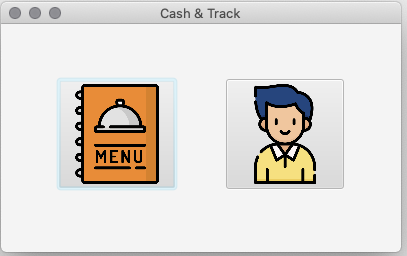
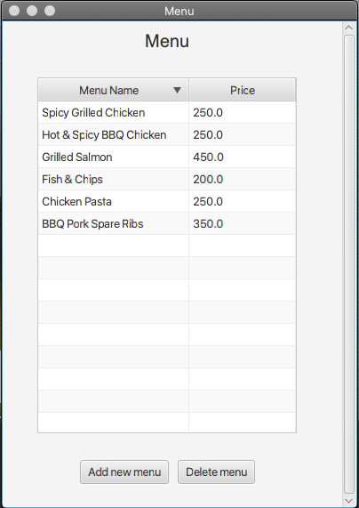
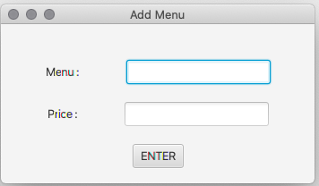
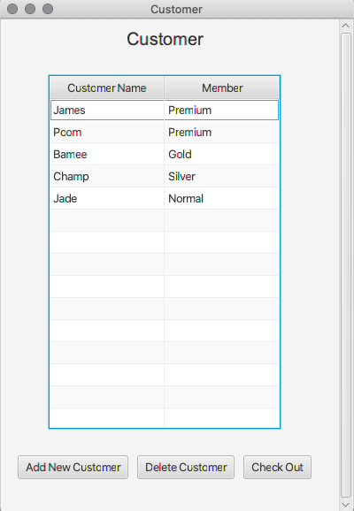
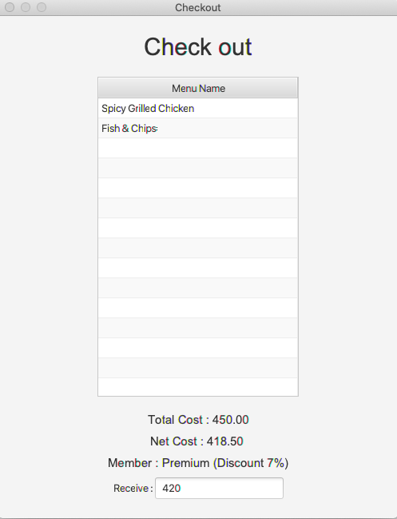
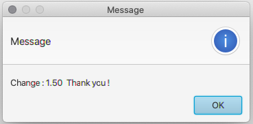

# Cash&Track
An application which improve the performance of  ordering, billing order and billing payment at restaurant.

# Project documents
* [Project Proposal](https://docs.google.com/document/d/1r1GHGjwS01i9EkbcIOv_BpXK6YHCbfBTRyN3w-n3S_s/edit)
* [Trello Board](https://trello.com/b/CndiwVJT/cash-track)

# Features
* Collecting the name of customer and menu
* Display the menu , customer's order and payment
* Calculate the total price , received and change money

# Requirements
The application requires
* [Java SE Development 11](https://www.oracle.com/java/technologies/javase-jdk11-downloads.html)
* [JavaFX Library](https://www.oracle.com/java/technologies/install-javafx-sdk.html)

# Installations
1. Clone this repository then go to the directory.
```
 $ git clone https://github.com/forfeen/CashAndTrack.git
```
2. Change directory to CashAndTrack
```
$ cd CashAndTrack
```
3. Compile the CashAndTrack.jar
```
$ java @vmargs -jar CashAndTrack.jar
```
# Usage
1. Choose the menu or customer feature.



 2. In the menu screen , you can see all menus in the table.
 
 If you want to delete the menu , select the row and click **Delete Menu** button.
 
  
 
 3. Add the menu by click the **Add new menu** button.
 
 
 
 4. In the customer screen , you can see all  customers in the table.
 
 
 Click  **Add New Customer** button to add new customer , select the row and click
  **Delete Menu** button to delete the customer.
 
 
 
 5. Double-click on the customer's row to add menu to cart.
 
 
 
 6. Select the customer's row and click **Check out** button to check out. 
  
  Enter in the text field and press **ENTER** key
 
 
 
 
 
 


# Author
Chananya Photan  61160545481